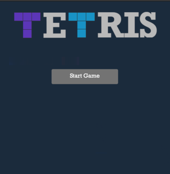
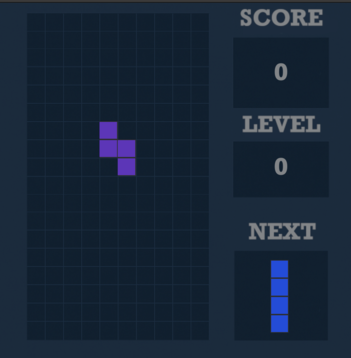
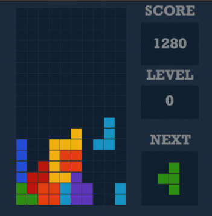
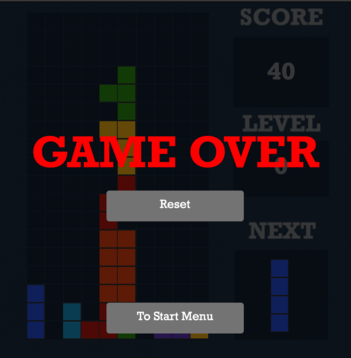
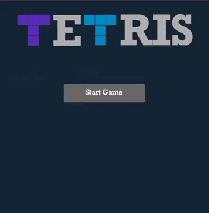

# Tetris Game

Tetris game that was created for university term paper in my first year. Because it is written in Qt the game is cross platform and very fast.

---

## Prerequisites

- **Qt Creator** (official download page [https://www.qt.io/product/development-tools](https://www.qt.io/product/development-tools))

---

## Building project

Open Qt Creator in "Edit" choose all files of Tetris folder. After that just click "Run" button in context menu or in bottom left.

---

## Game structure

Game is divided in three parts.

1. **Start Menu**

    Simple menu with just it's own name and button "Start Game".

2. **Game**

    Standard Tetris Game with score, increasing fall speed of figures after certain amount of removed lines and ability to see which figure will be next.

3. **Game Over**

    When figure that just appeared has been collided with figure that was already placed, the Game Over screen appears. You will see two buttons: "Reset" and "To Start Menu". As every button says, "Reset" button will reset game and you will start with 0 score and level. "To Start Menu" returns to Start Menu.

---

## Screenshots of game

- **Start Menu**

    

- **Gameplay**

    

    

- **Game Over**

    

---

## Gameplay

---

## How to Play

- **Move Left/Right** - Left and Right arrow keys

- **Rotate** - Up arrow key

- **Soft Drop** - Down arrow key

- **Hard Drop** - Spacebar

---

## Tech Stack

**Language**: C++

**Frameworks**: Qt

---

## Term paper

You can read the term paper of this project by this button "[Term Paper](paper.pdf)". It is fully written in Russian in academic style. Have Introduction, Description of project, Overview of existing solutions, Requirements for project, Architecture, Technological part with diagram of classes and diagram of game states, practical part with description of implementation, testing of product, documentation, conclusion, list of sources used and main parts of code.

---

## License

This project is licensed under the [MIT License](LICENSE).